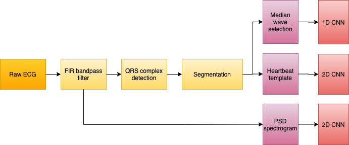
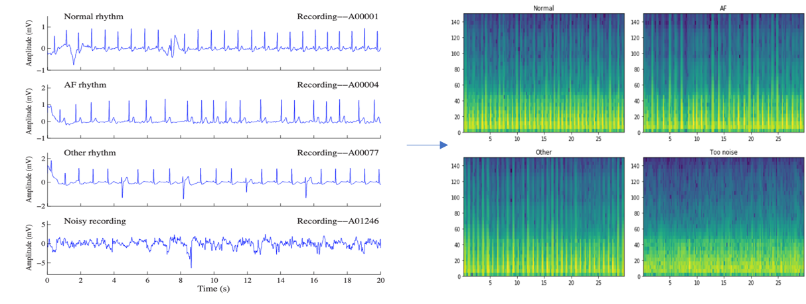

# Atrial Fibrillation Classification via 1D-CNN and 2D-CNN


## Requirements

- [Numpy](https://numpy.org/)
- [biosppy](https://biosppy.readthedocs.io/en/stable/)
- [opencv](https://opencv.org/)
- [pandas](http://https://pandas.pydata.org/)
- [TensorFlow](https://www.tensorflow.org/)

## Dataset
In this project, I use the open ECG dataset from [AF Classification from a Short Single Lead ECG Recording - The PhysioNet Computing in Cardiology Challenge 2017](https://physionet.org/content/challenge-2017/1.0.0/), dataset can be found in [here](https://physionet.org/static/published-projects/challenge-2017/af-classification-from-a-short-single-lead-ecg-recording-the-physionet-computing-in-cardiology-challenge-2017-1.0.0.zip).
### ECG Recordngs
In dataset, there are total 8528 short single lead ECG recordings collected by AliveCor device. The ECG recordings last from 9s to 60s and were sampled as 300Hz and have been band pass filtered by AliverCor device. The recordings have been categorized into 4 types: Normal rhythm, Atrial fibrillation, other rhythm and noisy recordings.

|Type|Recording|Mean|SD|Max|Median|                       Min|
|:---|:--------|:---|:-|:--|:-----|:-------------------------|
|Normal|5154|31.9|10.0|61.0|30|                           9.0|
|AF|771|31.6|12.5|60|30|                                 10.0|
|Other|2557|34.1|11.8|60.9|30|                            9.1|
|Noisy|46|27.1|9.0|60|30|                                10.2|
|**Total**|**8528**|**32.5**|**10.9**|**61.0**|**30**|**9.0**|


## Methodology
Overview


### Preprocessing
#### PSD spectrogram



### Segmentation
QRS complex detection

Heartbeat segmentation

### Feature
### Training and Validation

## Usage
1. Download ECG dataset:
Download dataset in [here](https://physionet.org/static/published-projects/challenge-2017/af-classification-from-a-short-single-lead-ecg-recording-the-physionet-computing-in-cardiology-challenge-2017-1.0.0.zip) and extract **training2017** and **sample2017** folders.

2. Execute preprocess.py to prepare training input for further CNN training
```bash
python3 Preprocess.py
``` 
3. Execute main.py for training model via convolution neural network
```bash
python3 main.py
```
4. After training, to see training result with [tensorboard](https://www.tensorflow.org/tensorboard/get_started), execute following command in terminal. Copy the url and open it with web broswer.
```bash
tensorboard --logdir logs/
```
## Demo
- 1DCNN_med_wave.ipynb : Use median wave extraction method to select features as training data, and training data with one dimension convolution neural network. 
- 2DCNN_templates.ipynb: Use heartbeat extraction method to generate heartbeat images as training data, and training data with two dimension convolution neural network.
- 2DCNN_specg.ipynb: Use spectrogram as training data, and training data with two dimension convolution neural network.  

## Conclusion

## Reference